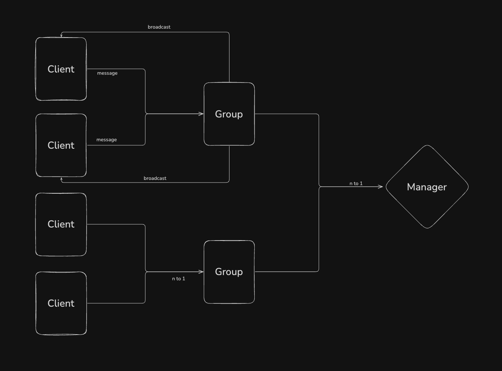

# Group Chat

This is an implementation of chat app with [websocket](https://pkg.go.dev/github.com/gorilla/websocket) in **Go** programming language.

### Client Test
[](https://www.youtube.com/watch?v=Mu-GBy0S4do)

## Running the application
Go development environment is required to run this application. You can install Go using the [Getting Started](https://go.dev/learn/) page.
Once you have Go up and running, you can download, build and run the application using the following commands.

```
$ git clone 
$ go get github.com/gorilla/websocket
$ go run .
```

> NOTE: This application is hardcoded to run on port `8080`. You can change this in `main.go` if you need to.



## Server
The application code starts from main.go.
The application defines four types; the `Handler`, `Client`, `Group`, `GroupsManager`. An handler is created with one instance of a `GroupsManager`. The manager's Run method is called in a goroutine. This is the only place the manager's Run method is called, as we have only one instance of a manager. The goroutine runs for the entirety of the application.

## Handler
The code for the `Handler` type is in handler.go

The handler holds a reference to a `GroupsManager`. 
- It provides the handler that creates a group with a provided id using `POST /create?id={groupID}` where groupID is the id of the group to create. It could be any character. This creates a `Group`, which in turns registers the group in the `GroupsManager`.
- It provides the handler that deletes a group with a given id using `DELETE /groups/{groupID}` where groupID is the id of the group to delete. It must be a valid id that has been created. Deleting a group removes it from the `GroupsManager` and finally disconnects all connections in that group.
- It handles all websocket connections with a groupID in it's path `ws://localhost:8080/groups/{groupID}` by upgrading the HTTP connection to the WebSocket protocol. It checks if the id provided is valid i.e is in the `GroupsManager`. It then creates a `Client` for the connection before finally registering the client in the found `Group`. The final action of this handler is spunning two goroutines; **Read** and **Write** to handle reading and writing to the connection. This is the only place reading and writing to a connection takes place, as adviced by the package - [Connections support one concurrent reader and one concurrent writer.](https://pkg.go.dev/github.com/gorilla/websocket?utm_source=godoc#hdr-Concurrency)

## GroupsManager
The code for the `GroupsManager` type is in groups_manager.go

The GroupsManager handles all created groups. It stores them in a map with the groupID as the key and the reference to the Group as value - `{"123": *Group}`. It also has two channels for registering and unregistering groups.

The manager's Run method handles registering and unregistering. It runs in a loop, listening for any group passed to both channels. When a group is passed to the register channel, it adds the group to `GroupsManger`.groups. When it is passed to the unregister channel instead, it deletes the group from `GroupsManger`.groups, before finally closing the group's broadcast channel. 

## Group
The code for the `Groups` type is in group.go

The Group handles all clients of the group. It stores clients in a map with the reference to the client as key and a bool as value (the value doesn't matter). It has three channels; two of them for registering and unregistering clients and the last one is a broadcast channel that sends outbound messages to every client (connection).
The group's Run method handles registering and unregistering. It runs in a loop, listening for any client passed to both channels. When a client is passed to the register channel, it adds the client to `Group`.clients. When it is passed to the unregister channel instead, it deletes the client from `Group`.clients and finally closing the client's send channel. After closing the client's send channel, a check is done to know if the current connection is the last to unregister. If it is, the group's Run goroutine is done; it exits. This is done to free up resources and avoid a goroutine leak. A log is added in the defer function block to verify the goroutine exits. 

In the broadcast case, if the broadcast channel is closed, the Run method delete all clients in the group before closing their send channels. If the broadcast channel is open and a message is received, the Run method iterates through the clients of that group and sends the message to their send channel.
Every group runs it's own Run goroutine. There can only be one goroutine each for every group.

## Client
The code for the `Client` type is in client.go

The client act as an intermediary between a websocket connection and a **group**. A client is created for every connection. The client holds a reference to the connection, a reference to the group it belongs to and a send channel, to write to the connection.

The client has a **Read** goroutine method which is called only once for the client as explained previously. It runs in a loop and listens for a message from the connection. It forwards the message to the client's group's broadcast channel. If the client's connection closes abruptly or at all, the defer statement sends the client to the group's unregister channel to unregister that particalar client, and finally call the `connection.Close` method before exiting the Read goroutine.

The client has a **Write** goroutine method which is called only once for the client as explained previously. It runs in a loop and listens for a message passed to the client's send channel. It writes this message to the client's connection. If the client's send channel closes, the defer statement calls the `connection.Close` method before exiting the Write goroutine.

## Frontend
The code for the frontend is in  /frontend

The frontend is not really necessary to run this application. This is just a web client written to provide a way to test the server application. The same thing could be achieved by using a client like [Postman](https://www.postman.com/). 
If you do want to use the frontend, it is written in [Flutter](https://flutter.dev/). You need to have flutter installed. You might also run into *CORS* issue trying to run it. You need to go figure out how to deal with this yourself.
